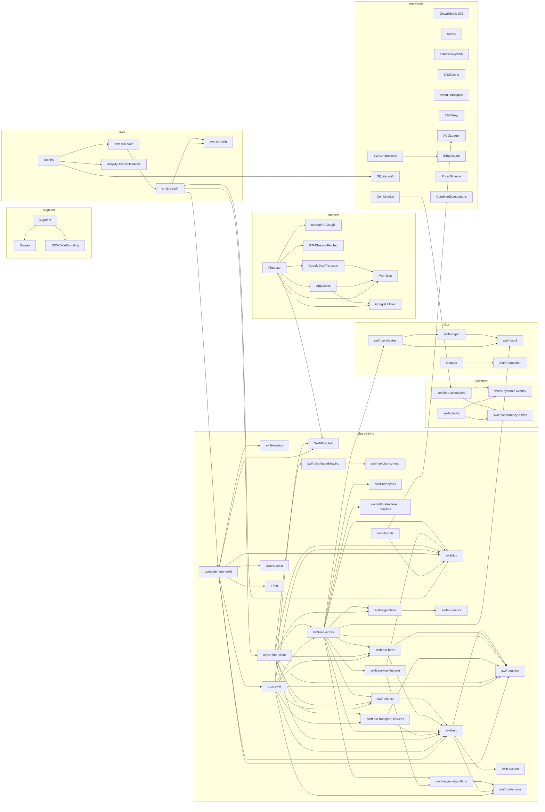

# Package Dependency Graph

> Render with: `dot -Tpng dependency-graph.dot -o dependency-graph.png`
> Or open `dependency-graph.md` in VS Code with Mermaid preview.

> **Red edges** cross group boundaries.

